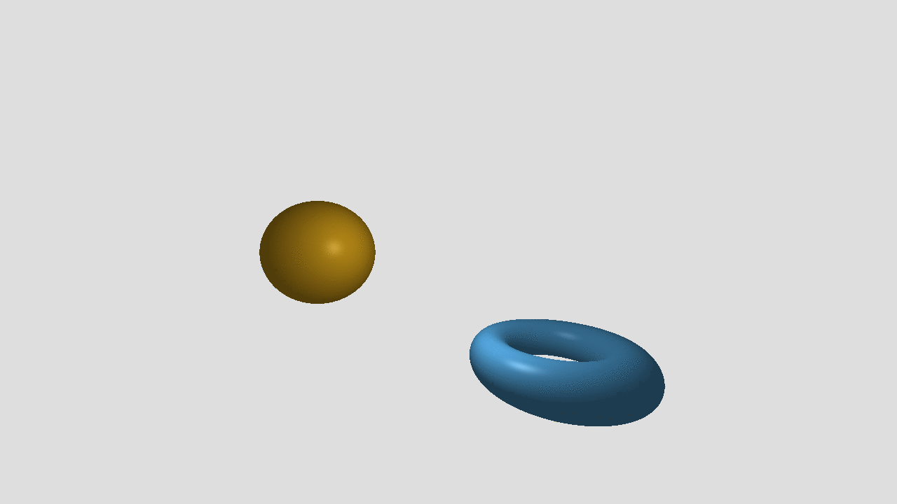
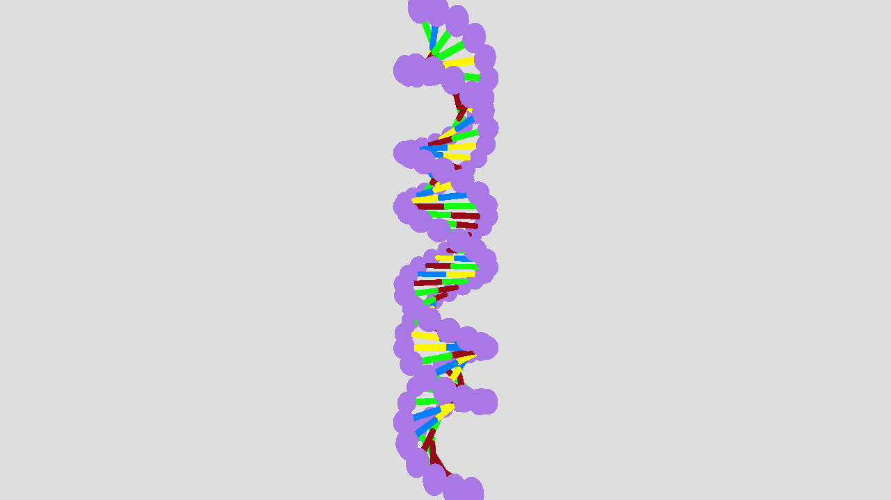

# Raymarching Project

A simple project using raymarching and signed distance functions to render 3d scenes

## Build

```
    mkdir build
    cd build
    cmake ..
    make
```

## Sample renders:





## Todo

  * Unified pipeline from animation to gif file
  * Investigate artifacting in the lighting demo
  * Learn cmake and fix the cmakelists file
  * Command line option
  * Support lighting and shadows
  * Add CSG primitives
  * Implement triangle inequality optimization
  * Some sort of spatial binning
  * Allow transformations to be grouped together. ie. group rotate and scale.
  * Figure out a good interpolation solution:
    * Make iterated transformations more efficient (transformations on transformations, instead of transformations on objects)
  * Organize scenes, and general clean up
  * Sit down and actually profile the code
