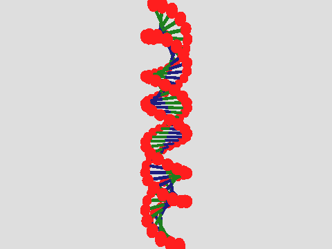

# Raymarching Project

A simple project using raymarching and signed distance functions to render 3d scenes

## Build

```
    mkdir build
    cd build
    cmake ..
    make
```

Sample renders:




## Todo
    * Support arbitrary transformations for objects (cameras, shapes)
    * Multithreading, most likely OpenMP
    * Implement GIF animations by stringing together images
    * Support lighting and shadows

